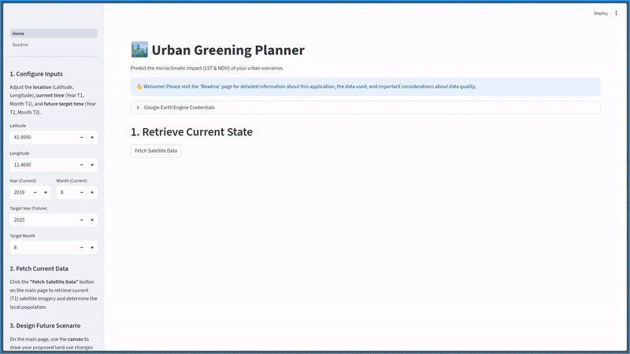

# 🏙️ Urban Greening Planner: High-Resolution LST and NDVI Forecasting

This project presents a data-driven deep learning framework designed to predict future Land Surface Temperature (LST) and Normalized Difference Vegetation Index (NDVI) maps conditioned on proposed changes in land cover. 
It serves as a tool to estimate the microclimatic impact of urban modifications.

The core model is a multi-modal U-Net that fuses high-resolution satellite imagery with non-spatial environmental context (static geographical and demographic metadata) to forecast environmental variables.

[](https://huggingface.co/spaces/4l3x4ndre/Metadata-Augmented-UNET-LST-NDVI-prediction)

## 🎯 Project Goal

As urban areas expand, accurate forecasting of the microclimatic impact of land-use changes is essential. This project aims to:
- Predict future LST and NDVI based on user-defined land-use change scenarios.
- Provide a rapid, scalable alternative to computationally expensive traditional simulations (e.g., CFD).
- Quantify cooling potentials of green infrastructure interventions.

Detailed methodology and results are available in the [manuscript](docs/manuscript.pdf) (*soon*).

## 🏗️ Architecture & Models

The project implements a **Metadata-Augmented U-Net** architecture.
- **Backbone:** Standard U-Net (or U-Net++) for spatial translation.
- **Embeddings:**
  - **Metadata Encoder:** An MLP processes static data (latitude, longitude, population, time delta) to condition the model on the climatic zone.
  - **Temporal Encoder (Optional):** An LSTM processes historical temperature time series (CRU data), though findings suggest static metadata is superior for this task.
- **Fusion:** Embeddings are broadcasted and concatenated at the U-Net bottleneck (or throughout the decoder in U-Net++).

Architecture diagram of the U-Net variants:


Source code for the models can be found in [`src/model.py`](src/model.py).

**Note:** Due to storage constraints, only 2 trained models are included in this repository:
1.  `BEST_metadata_unet.pth` (Our best performing model)
2.  `standard_no-embedding_unet.pth` (Baseline)

These two models are available in the [Hugging Face Space](https://huggingface.co/spaces/4l3x4ndre/Metadata-Augmented-UNET-LST-NDVI-prediction).

## ⚙️ Installation

1.  **Clone the repository:**
    ```bash
    git clone <repository_url>
    cd urban_planner
    ```

2.  **Install dependencies:**
    ```bash
    pip install -r requirements.txt
    ```

3.  **Earth Engine Setup:**
    The project relies on Google Earth Engine. Ensure you have a GEE account and authenticate:
    ```bash
    earthengine authenticate
    ```

4.  **Environment Variables (.env):**
    This project uses `dotenv` to manage environment variables. Create a `.env` file in the root directory of the project and populate it with the necessary variables. An example `.env` file might look like this:
    ```
    WANDB_API_KEY="your_wandb_api_key_here"
    GEE_SERVICE_ACCOUNT="your-gee-service-account@your-project-id.iam.gserviceaccount.com"
    GEE_PROJECT_ID="your-gee-project-id"
    ```
    Remember to replace the placeholder values with your actual API key, service account, and project ID. [Information on GEE service accounts](https://developers.google.com/earth-engine/guides/service_account).

5. **Data Acquisition:** 
   
   This project saves each sample as a separate `.npz` file. Due to data size constraints, the data set is not included in the repository. 
   To create the data set, run:
   
   ```bash
   python -m src.data.parallel_dataset 
   ``` 
   or use `hpc/dataset.slurm`

   Then: 

   ```bash
   python -m src.data.processing_10m.process
   ```
   or use `hpc/dataset_process_10m.slurm`.
   
   Processed temperatures are included. To download the raw temperatures:
   ```bash
   python -m src.data.nc_file_aggregator
   ```
   
   or use `hpc/dataset_process_temperature.slurm`.
   
## 🚀 Usage

### 🧪 Model Evaluation

The `test` directory contains a suite for evaluating trained model checkpoints.


To run the evaluation:

```bash

python test/evaluate.py --checkpoint-path /path/to/your/model.pth

```


**Key Features:**

- **Per-Class Metrics:** MAE/RMSE breakdown by Dynamic World land cover types.

- **Interpretable Errors:** Reports LST errors in °C.

- **Image Quality:** Assesses output sharpness using Laplacian Variance.

- **Visualizations:** Generates Ground Truth vs. Prediction plots.

- **WandB Integration:** Logs metrics to Weights & Biases.


See [`test/evaluate.py`](test/evaluate.py) for implementation details.


### 📱 App: Interactive Urban Greening Planner

The project includes an interactive Streamlit application (located at [`app/Home.py`](app/Home.py)) that allows you to explore the model's capabilities in a user-friendly interface. This application enables you to:

- Select any location and time period to fetch real-time satellite data from Google Earth Engine.
- Design custom urban greening or land-use change scenarios on an interactive canvas.
- Forecast the microclimatic impact (LST and NDVI) of your proposed changes using a pre-trained model.

**Getting Started with the App:**

1.  **Earth Engine Credentials:** The application fetches live data from Google Earth Engine. To use it, you will need to provide your [GEE credentials](https://developers.google.com/earth-engine/guides/service_account)

    *   **GEE Project ID:** Your Google Cloud Project ID linked to your Earth Engine account.
    *   **GEE Service Account:** The email address of your service account.
    *   **Service Account Private Key File (`.private-key.json`):** Ensure this file is present in the root directory of the project. You can find more information on setting up a service account [here](https://developers.google.com/earth-engine/guides/service_account).

    You can either set these credentials in a `.env` file (as described in the "Environment Variables" section above) or directly within the application's "Google Earth Engine Credentials" expander on the main page.

2.  **Run the Application:**

    ```bash
    streamlit run app/Home.py
    ```

3.  **Demo:**


    


## 📊 Data & Licensing

### 🛰️ Data Sources

All images come from [Google Earth Engine](https://earthengine.google.com/) datasets:

- **Satellite Imagery:** Sentinel-2 (ESA) and Landsat 8 (USGS).
- **Land Cover:** Dynamic World V1 (Google/WRI).
- **Climate Data:** Climatic Research Unit (CRU) Time Series.

Metadata source:

- **City Metadata:** [SimpleMaps World Cities Database](https://simplemaps.com/data/world-cities)

### ⚖️ Licenses
- **Code:** MIT License
- **CRU Data:** The Climatic Research Unit gridded Time Series (CRU) dataset is distributed under the Creative Commons Attribution License 4.0 and the Open Data Commons Attribution License. See [`docs/licenses/LICENSE_CRU.txt`](docs/licenses/LICENSE_CRU.txt) for full terms.
- **Copernicus Data:** Uses data from the Copernicus Climate Change Service.

### ⚖️ Code Used 

- **Beatiful Figures:** Andrey Churkin's repository [on GitHub](https://github.com/AndreyChurkin/BeautifulFigures/tree/main) under MIT License.
- **PyTorch Nested U-Net** 4ui_iurz1's repository [on GitHub](https://github.com/4uiiurz1/pytorch-nested-unet/) under MIT License.

## 📁 Directory

```
urban_planner/
├── conf/               # Configuration files
├── app/                # Streamlit application
├── app_dev/            # Streamlit application used to produce figures and interpret results
├── data/               # Data storage (raw/processed)
├── docs/               # Documentation and manuscript
├── hpc/                # SLURM scripts for HPC
├── src/                # Source code (data loading, modeling, training)
├── test/               # Evaluation scripts
└── reports/            # Generated analysis and figures
```
